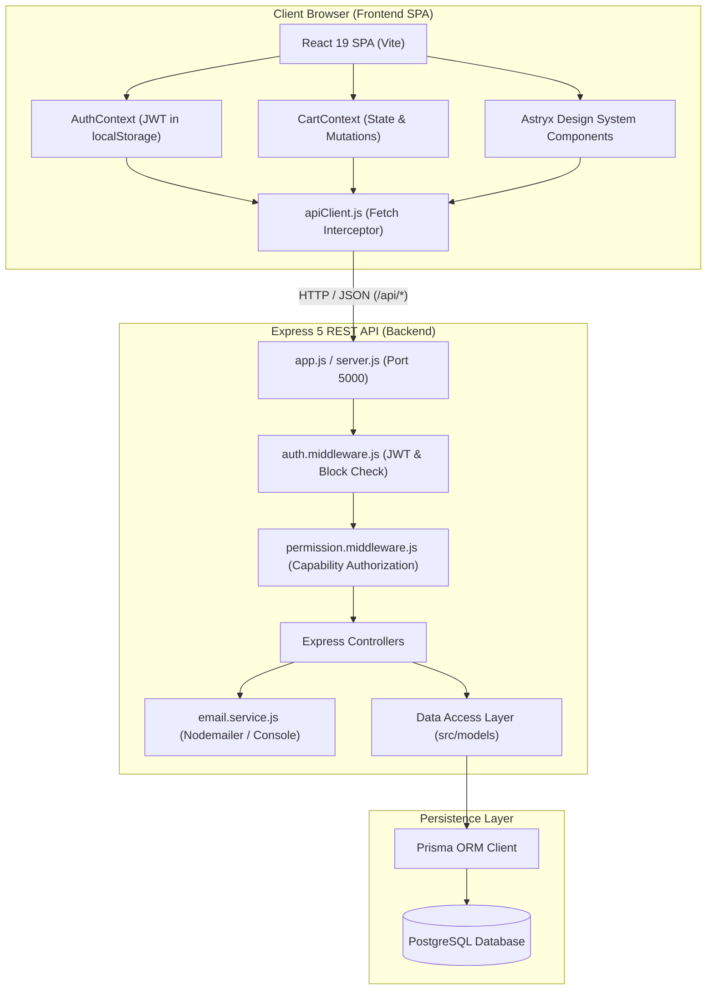

# tsshop - Full-Stack Electronics E-Commerce Platform

## Overview

**tsshop** is a modern full-stack electronics e-commerce storefront, operations management, and administrative control platform. It provides a customer shopping storefront, a dedicated operations workspace for store staff, and an administration suite.

The platform is structured as a monorepo with two decoupled, independently runnable applications:
- **Backend (`backend/`):** Express 5 REST API server built on Node.js, Prisma ORM 6, and PostgreSQL. It manages authentication, capability-based authorization, catalog data, persistent user shopping carts, transactional Cash-on-Delivery (COD) checkout, customer reviews, operational and financial reporting, storefront content trees, and OTP-based email password verification.
- **Frontend (`frontend/`):** Single Page Application (SPA) built on React 19, React Router 6, and Vite 5, styled with the `@astryxdesign/core` design system. It provides role-aware navigation (including direct **Staff** and **Admin** tabs in the header for authorized users) and specialized workspaces (`/` for customers, `/staff/*` for operations staff, and `/admin/*` for administrators).
---

## Sub-Module Documentation

For deep technical details, module-specific architecture, route maps, component trees, and local configurations, refer to the dedicated READMEs:

- 📘 **[Backend Documentation (`./backend/README.md`)](./backend/README.md)** — Express 5 API endpoints, Prisma schema models, middlewares, controllers, services, database migrations, and testing.
- 📙 **[Frontend Documentation (`./frontend/README.md`)](./frontend/README.md)** — React 19 SPA architecture, React Router v6 guards, Context providers, Astryx design system components, and API client layers.

---

## What This Folder Does

This repository root coordinates the full development, build, and deployment lifecycle of the **tsshop** platform:

1. **Full-Stack Application Delivery:** Combines the Node/Express backend API and the Vite/React frontend SPA into a cohesive web application.
2. **Database Schema & Migrations:** Houses the canonical PostgreSQL database schema (`backend/prisma/schema.prisma`), database migration history, and database seed scripts.
3. **End-to-End E-Commerce Workflows:** Implements customer registration, OTP-based password recovery, catalog browsing, cart operations, transactional COD checkout, order status management, review moderation, and storefront customization.

---

## Repository Structure

```text
.
├── backend/                     # Express 5 REST API & Prisma persistence layer
│   ├── prisma/                  # Prisma schema, SQL migrations, database seed scripts
│   │   ├── migrations/          # Version-controlled migration history
│   │   │   ├── 20260708193000_add_user_blocked_status/
│   │   │   ├── 20260709000000_add_password_change_otp/
│   │   │   ├── 20260710000000_add_staff_role/
│   │   │   ├── 20260930000000_add_order_recipient_snapshot/
│   │   │   └── 20261002000000_add_structured_vietnam_addresses/
│   │   ├── schema.prisma        # Authoritative PostgreSQL data schema (customer, staff, admin)
│   │   └── seed.js              # Initial database seed script (admin, categories, products)
│   ├── src/                     # Backend application source code
│   │   ├── config/              # Database client and centralized capability permissions matrix
│   │   │   ├── database.js
│   │   │   └── permissions.js
│   │   ├── controllers/         # HTTP request controllers for all domains
│   │   ├── middlewares/         # JWT auth, capability authorization, validation, error handling
│   │   │   ├── auth.middleware.js
│   │   │   ├── permission.middleware.js
│   │   │   ├── validation.middleware.js
│   │   │   └── error.middleware.js
│   │   ├── models/              # Prisma database query encapsulation models
│   │   ├── routes/              # Express route declarations & route index
│   │   ├── services/            # Nodemailer email & OTP delivery service
│   │   ├── utils/               # Response envelopes, password/phone/quantity validators, token & OTP helpers
│   │   ├── app.js               # Express application initialization & middleware stack
│   │   └── server.js            # Server entrypoint listening on PORT
│   ├── .env.example             # Backend environment variable template
│   ├── package.json             # Backend dependencies and scripts
│   └── README.md                # Dedicated backend documentation
├── frontend/                    # Vite + React 19 Single Page Application
│   ├── src/                     # Frontend application source code
│   │   ├── api/                 # Domain API client modules (auth, products, orders, etc.)
│   │   ├── components/          # Feature UI components (product, cart, checkout, admin, common)
│   │   │   ├── common/          # Reusable UI primitives (PageHeader, DataTable, FilterBar, StatusBadge, etc.)
│   │   │   └── ...
│   │   ├── constants/           # Order constants & permissions capability matrix
│   │   ├── contexts/            # React Context providers (AuthContext, CartContext, NotificationContext)
│   │   ├── layouts/             # Layout shells (MainLayout with Staff/Admin tabs, AuthLayout, AdminLayout, StaffLayout)
│   │   ├── routes/              # React Router v6 route table & guards (PrivateRoute, StaffRoute, AdminRoute)
│   │   ├── utils/               # Frontend validators (password, phone, quantity) and formatters
│   │   ├── views/               # Page views (Storefront, Staff workspace, Admin workspace)
│   │   │   ├── staff/           # Dedicated staff operations views (Dashboard, Orders, Inventory, Reviews, Reports)
│   │   │   ├── admin/           # Dedicated admin management views
│   │   │   └── ...
│   │   ├── App.jsx              # Root component with providers and router
│   │   ├── config.js            # Frontend configuration (API base URL)
│   │   └── main.jsx             # SPA entrypoint mounting React and Astryx styles
│   ├── .env.example             # Frontend environment variable template
│   ├── index.html               # Main HTML entry point
│   ├── package.json             # Frontend dependencies and scripts
│   ├── vite.config.js           # Vite build and dev configuration
│   └── README.md                # Dedicated frontend documentation
├── openspec/                    # OpenSpec specifications, design docs, and implementation tasks
├── docs/                        # Project documentation and specifications
└── README.md                    # Root project documentation (this file)
```

---

## Technology Stack

| Layer | Technology | Details |
| :--- | :--- | :--- |
| **Backend Runtime** | Node.js | CommonJS modules (`node src/server.js`) |
| **Backend Framework** | Express 5 (`^5.2.1`) | High-performance routing, middleware, and JSON parsing |
| **Database & ORM** | PostgreSQL + Prisma 6 (`^6.4.0`) | Type-safe queries, connection pooling, and schema migrations |
| **Security & Auth** | JWT (`^9.0.3`) + bcrypt (`^6.0.0`) | Bearer token authentication and salted password hashing |
| **Email Service** | Nodemailer (`^9.0.3`) | OTP delivery supporting SMTP and local console mode |
| **Frontend Framework** | React 19 (`^19.2.7`) | Functional components and hooks |
| **Frontend Router** | React Router 6 (`^6.22.3`) | Declarative client-side routing with route guards |
| **UI Design System** | Astryx Design System (`@astryxdesign/core`) | Modern, consistent UI components, layout tokens, and styling |
| **Frontend Tooling** | Vite 5 (`^5.2.0`) + ESLint 8 | Fast HMR dev server and optimized production bundling |

---

## System Architecture & Data Flow



### Communication Flow
1. **Client Requests:** The React SPA communicates with the backend exclusively via standard HTTP JSON requests sent to the `/api` prefix (configured via `VITE_API_BASE_URL`).
2. **Authentication Token Injection:** When a customer, staff member, or administrator logs in, the API returns a signed JWT. The frontend stores this token in `localStorage` and `apiClient.js` automatically attaches it as an `Authorization: Bearer <token>` header to all subsequent requests.
3. **Session Verification & Blocking:** On every protected API call, `auth.middleware.js` verifies the JWT signature, reloads the user from the database, and checks `isBlocked`. If the account is blocked, the request is immediately rejected with HTTP 403.
4. **Data Transactions:** Order placement executes inside a transactional boundary (`prisma.$transaction`), creating order records, updating payment records, and purging cart items atomically.

---

## Main Workflows

### 1. User Registration & Authentication
- **Registration:** User submits username, email, and password. The password is validated against the password policy (min 8 characters, uppercase, lowercase, number, special char). A bcrypt hash is stored in PostgreSQL.
- **Login:** User submits credentials. If valid and `isBlocked === false`, a JWT token is generated and returned.
- **Session Sync:** On application load, `AuthContext` calls `GET /api/auth/me` to refresh user details and verify token validity.

### 2. OTP-Based Password Recovery & Change
- **Forgot Password (Unauthenticated):** User requests an OTP via `POST /api/auth/forgot-password/request-otp`. The backend generates a 6-digit numeric OTP, saves the SHA-256 hash to `PasswordChangeOtp` with a 10-minute expiry, and dispatches an email via Nodemailer (or logs to console in development). The user submits the OTP to reset their password via `POST /api/auth/forgot-password/reset`.
- **Change Password (Authenticated):** A logged-in user requests an OTP by verifying their current password (`POST /api/auth/change-password/request-otp`). Upon receiving the code, the user submits current password, OTP, and new password (`POST /api/auth/change-password/confirm`). The backend verifies the OTP hash atomically and updates the password hash.

### 3. Catalog Browsing, Search & Storefront Content
- **Mega-Menu Navigation:** `StorefrontMegaNav` fetches the hierarchical navigation tree from `GET /api/storefront/navigation` and renders categories, product shortcuts, and featured promotions.
- **Homepage Carousel:** `HomeHero` fetches active banner slides from `GET /api/storefront/carousel`.
- **Product Catalog:** `ProductListView` supports multi-attribute filtering (category, price range, brand), keyword search, sorting (price, newness, popularity), and pagination via `GET /api/products`.
- **Product Details & Reviews:** `ProductDetailView` displays product specifications, inventory status, and user reviews fetched from `GET /api/products/:id/reviews`.

### 4. Shopping Cart & Transactional COD Checkout
- **Cart Management:** Authenticated users add products to their cart. Cart state is persisted to PostgreSQL (`Cart` and `CartItem` tables) and synchronized with `CartContext`.
- **Checkout:** The checkout form prefills the recipient name, phone, and a complete structured address from the user's profile. If profile loading fails, it leaves those fields blank, displays a notice, and still allows manual entry. `POST /api/orders` requires a 10–50 character full name (after trimming), a phone kept as a 9–11 digit string (preserving leading zeroes), and the structured address `{ provinceCode, wardCode, streetRef, detail }`; the server resolves authoritative current names before writing. It stores an immutable recipient and structured shipping-address snapshot per order, so later profile edits do not change existing orders. Order details, COD payment (`unpaid`), conditional stock decrement, and selected cart-line removal remain atomic; stock/cart races return HTTP 409.
- **Vietnam address selection:** Address entry uses two current administrative levels—province/city then ward/commune/special zone—with provider-backed street selection; there is no district field. A legacy-only `User.address` is displayed as unverified, read-only text and must be reselected before checkout or profile replacement. The bundled data is v5.2.0, effective 2026-09-20 (upstream updated `2026-09-20T13:13:17Z`); the backend README documents source, MIT license, address API, exact validations, and rollout/backfill rules.
- **Order Tracking & Self-Cancel:** `OrderHistoryView` lists the customer's orders and `OrderDetailView` shows one order with a `Hủy đơn hàng` action. `PUT /api/orders/:id/cancel` is accepted only while the order is `pending` or `confirmed`; the backend cancels it transactionally and restocks every line item. The page then renders the `cancelled` state and hides the cancel action.

### 5. Administration & Staff Operations
- **Operations Staff Workspace (`/staff/*`):** Staff members process customer orders (`orders.view_all`, `orders.update_status`), monitor and adjust inventory counts (`products.update_stock`), hide inappropriate customer reviews (`reviews.moderate`), and view fulfillment summaries (`reports.view_operational`).
- **Catalog Management:** Administrators create, edit, and delete categories and products, set pricing, adjust stock levels, and upload product images.
- **User Moderation & Roles:** Administrators list users, inspect profiles, assign user roles (`customer` / `staff` / `admin`), and block/unblock accounts. `GET /api/admin/users?role=customer|staff|admin` combines the role filter with search; changing role resets to page 1, **Clear filters** resets role/search/page, and successful role changes reload the active results and recover from an empty/out-of-range final page. The `Thêm tài khoản` dialog (`UserCreateDialog`) posts to `POST /api/admin/users`, which applies the shared password policy and emails the new account its login credentials (email failures are logged without failing the request).
- **Order Processing:** Administrators and Staff view system-wide orders and move them through the enforced lifecycle (`pending → confirmed → shipping → completed`, with `cancelled` reachable from those three states). Illegal transitions are rejected with HTTP 400, cancelling restocks inventory, and completing marks the COD payment as `paid`. The admin status selector only offers the current status plus its allowed next statuses.
- **Review Moderation:** Administrators and Staff inspect customer reviews and hide inappropriate comments (`status = 'hidden'`) from the storefront.
- **Financial & Operational Analytics:** Administrators inspect financial revenue reports via `/api/admin/reports/revenue`, while Staff and Administrators inspect operational order status distributions and top-selling product volume via `/api/admin/reports/order-summary` and `/api/admin/reports/best-selling-products`. `ReportView` filters all reports by date range and exports true XLSX workbooks with `Revenue`, `Order Summary`, and `Best Selling Products` sheets; the existing UTF-8 CSV exports remain available.
- **Storefront Management:** Administrators manage homepage carousel slides, navigation menu items, and featured product displays.
---

## Environment & Configuration

### Root & Backend Environment (`backend/.env`)
Create `backend/.env` using `backend/.env.example` as a template:

| Variable | Required | Default | Description |
| :--- | :--- | :--- | :--- |
| `PORT` | No | `5000` | HTTP port for the Express API server |
| `DATABASE_URL` | Yes | - | PostgreSQL connection string with pooling |
| `DIRECT_URL` | No | - | PostgreSQL direct connection string for Prisma migrations |
| `JWT_SECRET` | Yes | - | Secret key for signing and verifying JWT tokens |
| `JWT_EXPIRES_IN` | No | `7d` | JWT expiration duration |
| `NODE_ENV` | No | `development` | Application environment (`development` / `production`) |
| `ADDRESS_PROVIDER` | Yes for provider-backed address operations | `vietmap` | Server-side address provider selection; never configure it in Vite |
| `VIETMAP_API_KEY` | Yes for provider-backed address operations | - | Backend-only VietMap secret; never expose it as a frontend `VITE_` variable |
| `PASSWORD_OTP_EXPIRES_MINUTES` | No | `10` | Expiration window for password change OTPs |
| `PASSWORD_OTP_MAX_ATTEMPTS` | No | `5` | Maximum failed OTP attempts before invalidation |
| `PASSWORD_OTP_DELIVERY_MODE` | No | `console` | OTP delivery mode: `console` (dev) or `smtp` (prod) |
| `SMTP_HOST` | If SMTP | - | SMTP server host |
| `SMTP_PORT` | If SMTP | `587` | SMTP server port |
| `SMTP_USER` | If SMTP | - | SMTP server authentication username |
| `SMTP_PASS` | If SMTP | - | SMTP server authentication password |
| `SMTP_FROM` | If SMTP | `no-reply@example.com` | Sender address for system emails |

> **Local QA migration safety:** point **both** `DATABASE_URL` and `DIRECT_URL` at the same isolated local database before running any Prisma command. `backend/prisma/schema.prisma` declares `directUrl = env("DIRECT_URL")`, and Prisma uses that URL for schema and migration work, overriding the connection otherwise used by the CLI — if `DIRECT_URL` points anywhere else, `prisma migrate` writes there instead. Never point local QA at a shared or remote database, and never commit `.env` files.

> **Structured address rollout:** The additive migration and legacy-backfill runbook is in [backend/README.md](./backend/README.md). Backfill defaults to dry-run; writes require `--apply --backup-confirmed`, and a remote database additionally requires `--allow-remote-db`. The CLI uses only `DATABASE_URL`, preserves `User.address` and all orders, and requires a reviewed/restorable backup. The runbook does not claim a production migration or live VietMap provider QA has occurred.

### Frontend Environment (`frontend/.env`)
Create `frontend/.env` using `frontend/.env.example` as a template:

| Variable | Required | Default | Description |
| :--- | :--- | :--- | :--- |
| `VITE_API_BASE_URL` | No | `http://localhost:5000/api` | Backend API base URL |

---

## Setup & Installation

### Prerequisites
- **Node.js:** v18+ (v20+ recommended)
- **npm:** v9+
- **PostgreSQL:** Running PostgreSQL database instance

### 1. Clone & Install Dependencies
```bash
# Clone the repository
git clone <repository-url>
cd BTL_END

# Install backend dependencies
cd backend
npm install

# Install frontend dependencies
cd ../frontend
npm install
cd ..
```

### 2. Configure Environment Files
```bash
# Configure backend environment
cp backend/.env.example backend/.env
# Edit backend/.env with your DATABASE_URL and JWT_SECRET
# For local QA, set BOTH DATABASE_URL and DIRECT_URL to the same isolated local database
# (schema.prisma's directUrl is what Prisma uses for migrations)

# Configure frontend environment
cp frontend/.env.example frontend/.env
```

### 3. Database Setup & Seeding
```bash
cd backend

# Generate Prisma Client
npm run prisma:generate

# Apply database migrations
# (local QA: DATABASE_URL and DIRECT_URL must both target the same isolated local
#  database — see Environment & Configuration above)
npm run prisma:migrate

# Seed demo data (admin account, sample categories, sample products)
npm run prisma:seed

cd ..
```

---

## Running the Project

### Option A: Running Backend & Frontend in Separate Terminals

**Terminal 1 — Start Backend API:**
```bash
cd backend
npm run dev
# Server listening on http://localhost:5000
```

**Terminal 2 — Start Frontend SPA:**
```bash
cd frontend
npm run dev
# Vite dev server running at http://localhost:5173
```

In local development the SPA at `http://localhost:5173` calls the API at `http://localhost:5000/api` (the frontend default `VITE_API_BASE_URL`); CORS is enabled on the Express app, so no extra origin configuration is required.

### Option B: Production Build
```bash
# Build frontend static assets
cd frontend
npm run build

# Start backend server
cd ../backend
npm start
```

---

## Testing & Validation

### Backend Testing
```bash
cd backend

# Run controller, model, middleware, route, and utility tests
node --test src/controllers/*.test.js
node --test src/models/*.test.js
node --test src/middlewares/*.test.js
node --test src/routes/*.test.js
node --test src/services/*.test.js
node --test src/utils/*.test.js
```

### Frontend Linting
```bash
cd frontend
npm run lint
```

---

## Development Notes for AI Agents

When modifying or extending this codebase, adhere to the following rules:

1. **Source of Truth Files:**
   - Database schema: `backend/prisma/schema.prisma`
   - Backend route registrations: `backend/src/app.js` and `backend/src/routes/index.js`
   - Frontend routing & access guards: `frontend/src/routes/AppRoutes.jsx`
   - Shared API client: `frontend/src/api/apiClient.js`
2. **Component & Styling Conventions:**
   - The frontend uses the **Astryx Design System** (`@astryxdesign/core`). Do not introduce ad-hoc CSS frameworks or conflicting component libraries. Reuse Astryx primitives and CSS variables.
3. **Authentication & Token Lifecycle:**
   - The backend validates tokens on each protected request and re-reads user status from PostgreSQL. If `user.isBlocked` is true, the request fails with 403. Frontend `AuthContext` catches this and forces a logout.
4. **Atomic Operations:**
   - Multi-table mutations (e.g. checkout creating orders, order details, payments, and deleting cart items) MUST run inside a `prisma.$transaction` block in the respective model file.
5. **Standardized Response Envelopes:**
   - Backend routes must return standard envelopes from `backend/src/utils/response.js`:
     - Success: `successResponse(res, statusCode, message, data)`
     - Paginated: `paginatedResponse(res, statusCode, message, data, pagination)`
     - Error: `errorResponse(res, statusCode, message, errors)`
6. **Password & Shared Validation Contracts:**
   - Client validation (`frontend/src/utils/passwordPolicy.js`) and backend validation (`backend/src/utils/passwordPolicy.js`) must remain strictly synchronized.
   - Phone validation (`frontend/src/utils/phoneValidation.js`, `backend/src/utils/phoneValidation.js`) accepts digits-only strings and must never coerce a phone number to a number (leading zeros must survive); profile edits allow an empty phone, checkout requires it.
   - Quantity validators (`frontend/src/utils/quantityValidation.js`, `backend/src/utils/quantityValidation.js`) reject invalid values instead of clamping: inventory counts are non-negative integers, purchase quantities must be `1..stock`.
7. **Stock Freshness:**
   - Keep cart/product reads (`GET /cart`, `GET /products`, `GET /products/:id`) `no-store` on both sides; checkout must keep the conditional `quantity >= ordered` stock decrement inside the transaction so races fail with HTTP 409 instead of overselling.
8. **Cross-Links Between READMEs:**
   - Maintain the direct relative links between root `README.md`, `backend/README.md`, and `frontend/README.md` whenever reorganizing files.

---

## Known Gaps & Limitations

- **Payment Methods:** Currently, only Cash on Delivery (`COD`) is supported (`PaymentMethod` enum has only `COD`). Online payment gateways (e.g. Stripe, PayPal, VNPay) are not yet implemented.
- **Image Storage:** Product and carousel images currently use URLs (`imageUrl: String`). Direct multipart file upload to S3 or cloud storage is not yet configured.
- **Seed Photo Coverage:** All 40 models have photos: 17 licensed local WebP assets retain public attribution, and 23 use direct manufacturer/retailer URLs with unverified reuse permission. External links can change; unavailable photos use the generic fallback. See the [image-only update and photo QA commands](backend/README.md#3-database-migration--seeding); do not re-run a full seed on a populated database just to change photos.
- **Live WebSocket Notifications:** Order status changes are polled on page load/navigation rather than pushed in real time via WebSockets.
