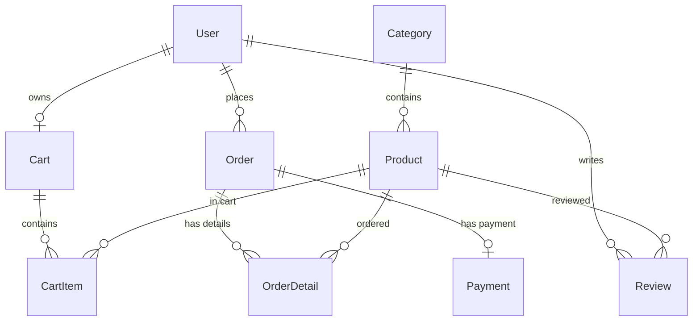

# Database Design and ERD

This document describes the database currently implemented by
`backend/prisma/schema.prisma`. That Prisma schema is authoritative if this
document and the runtime schema ever differ.

---

## 1. Schema Contract

- Prisma is the ORM and Supabase provides the PostgreSQL database.
- The React frontend accesses data only through the Express API; it does not
  connect to Supabase or Prisma directly.
- Authentication is implemented by the application with JWT and bcrypt, not
  Supabase Auth.
- Schema changes require a reviewed Prisma migration and coordinated updates
  to affected model, controller, API, and view code.

---

## 2. Models & Fields Summary

The schema consists of **9 primary entities** mapped through Prisma to the Supabase PostgreSQL database.

### 2.1. User
Represents customers and administrators.
- **Fields:**
  - `id` (String, UUID, Primary Key)
  - `username` (String)
  - `email` (String, Unique)
  - `passwordHash` (String, mapped to database as `password_hash`)
  - `fullName` (String, Optional, mapped to database as `full_name`)
  - `phone` (String, Optional)
  - `address` (String, Optional)
  - `role` (Role enum: `customer`, `admin`, default: `customer`)
  - `createdAt` (DateTime, default: `now()`, mapped as `created_at`)
  - `updatedAt` (DateTime, updated automatically, mapped as `updated_at`)
- **Relationships:**
  - `cart` (1-to-1 with `Cart`)
  - `orders` (1-to-many with `Order`)
  - `reviews` (1-to-many with `Review`)

### 2.2. Category
Groups products for catalog navigation.
- **Fields:**
  - `id` (String, UUID, Primary Key)
  - `name` (String, Unique)
  - `description` (String, Optional)
  - `createdAt` (DateTime, default: `now()`, mapped as `created_at`)
  - `updatedAt` (DateTime, updated automatically, mapped as `updated_at`)
- **Relationships:**
  - `products` (1-to-many with `Product`)

### 2.3. Product
Represents items available for purchase in the store.
- **Fields:**
  - `id` (String, UUID, Primary Key)
  - `name` (String)
  - `brand` (String)
  - `description` (String, Optional)
  - `price` (Decimal, precision `10, 2`)
  - `quantity` (Int, stock level)
  - `imageUrl` (String, Optional, mapped as `image_url`)
  - `categoryId` (String, UUID, Foreign Key, mapped as `category_id`)
  - `createdAt` (DateTime, default: `now()`, mapped as `created_at`)
  - `updatedAt` (DateTime, updated automatically, mapped as `updated_at`)
- **Relationships:**
  - `category` (Many-to-1 with `Category` via `categoryId`)
  - `cartItems` (1-to-many with `CartItem`)
  - `orderDetails` (1-to-many with `OrderDetail`)
  - `reviews` (1-to-many with `Review` with cascade delete on product deletion)

### 2.4. Cart
A shopping cart associated with a specific user.
- **Fields:**
  - `id` (String, UUID, Primary Key)
  - `userId` (String, UUID, Unique, Foreign Key, mapped as `user_id`)
  - `createdAt` (DateTime, default: `now()`, mapped as `created_at`)
  - `updatedAt` (DateTime, updated automatically, mapped as `updated_at`)
- **Relationships:**
  - `user` (1-to-1 with `User` via `userId`)
  - `items` (1-to-many with `CartItem` with cascade delete on cart deletion)

### 2.5. CartItem
An item placed within a user's shopping cart.
- **Fields:**
  - `id` (String, UUID, Primary Key)
  - `cartId` (String, UUID, Foreign Key, mapped as `cart_id`)
  - `productId` (String, UUID, Foreign Key, mapped as `product_id`)
  - `quantity` (Int)
  - `unitPrice` (Decimal, precision `10, 2`, mapped as `unit_price`)
  - `createdAt` (DateTime, default: `now()`, mapped as `created_at`)
  - `updatedAt` (DateTime, updated automatically, mapped as `updated_at`)
- **Constraints & Indexes:**
  - `@@unique([cartId, productId])` (Prevents duplicate entries of the same product in a single cart)
- **Relationships:**
  - `cart` (Many-to-1 with `Cart` via `cartId`, cascade delete on cart deletion)
  - `product` (Many-to-1 with `Product` via `productId`)

### 2.6. Order
An order placed by a user.
- **Fields:**
  - `id` (String, UUID, Primary Key)
  - `userId` (String, UUID, Foreign Key, mapped as `user_id`)
  - `totalAmount` (Decimal, precision `10, 2`, mapped as `total_amount`)
  - `status` (OrderStatus enum, default: `pending`)
  - `shippingAddress` (String, mapped as `shipping_address`)
  - `createdAt` (DateTime, default: `now()`, mapped as `created_at`)
  - `updatedAt` (DateTime, updated automatically, mapped as `updated_at`)
- **Relationships:**
  - `user` (Many-to-1 with `User` via `userId`)
  - `details` (1-to-many with `OrderDetail` with cascade delete on order deletion)
  - `payment` (1-to-1 with `Payment` with cascade delete on order deletion)

### 2.7. OrderDetail
Line items within an order.
- **Fields:**
  - `id` (String, UUID, Primary Key)
  - `orderId` (String, UUID, Foreign Key, mapped as `order_id`)
  - `productId` (String, UUID, Foreign Key, mapped as `product_id`)
  - `quantity` (Int)
  - `price` (Decimal, precision `10, 2`)
- **Relationships:**
  - `order` (Many-to-1 with `Order` via `orderId`, cascade delete on order deletion)
  - `product` (Many-to-1 with `Product` via `productId`)

### 2.8. Payment
The payment record linked to an order.
- **Fields:**
  - `id` (String, UUID, Primary Key)
  - `orderId` (String, UUID, Unique, Foreign Key, mapped as `order_id`)
  - `paymentMethod` (PaymentMethod enum, default: `COD`, mapped as `payment_method`)
  - `paymentStatus` (PaymentStatus enum, default: `unpaid`, mapped as `payment_status`)
  - `amount` (Decimal, precision `10, 2`)
  - `paymentDate` (DateTime, Optional, mapped as `payment_date`)
- **Relationships:**
  - `order` (1-to-1 with `Order` via `orderId`, cascade delete on order deletion)

### 2.9. Review
A user review and rating for a specific product.
- **Fields:**
  - `id` (String, UUID, Primary Key)
  - `userId` (String, UUID, Foreign Key, mapped as `user_id`)
  - `productId` (String, UUID, Foreign Key, mapped as `product_id`)
  - `rating` (Int; the Prisma/database schema does not add a range constraint)
  - `comment` (String, Optional)
  - `status` (ReviewStatus enum, default: `visible`)
  - `createdAt` (DateTime, default: `now()`, mapped as `created_at`)
  - `updatedAt` (DateTime, updated automatically, mapped as `updated_at`)
- **Relationships:**
  - `user` (Many-to-1 with `User` via `userId`)
  - `product` (Many-to-1 with `Product` via `productId`, cascade delete on product deletion)

---

## 3. Database Enums

To ensure data integrity, the schema leverages five strict enums.

| Enum Name | Allowed Values | Description |
|---|---|---|
| `Role` | `customer`, `admin` | User authorization privileges. |
| `OrderStatus` | `pending`, `confirmed`, `shipping`, `completed`, `cancelled` | Lifespan stages of a customer order. |
| `PaymentMethod` | `COD` | Supported payment options (Phase 1/2 restricted to COD). |
| `PaymentStatus` | `unpaid`, `paid`, `failed` | Transaction payment states. |
| `ReviewStatus` | `visible`, `hidden` | Review moderation status. |

---

## 4. Relationship Summary and ERD

The relation properties such as `User.cart`, `Order.details`, and
`Product.reviews` are Prisma navigation fields, not additional database
columns. Foreign keys live on the child entities shown below.



---

## 5. Supabase and Prisma Migration Notes

The Prisma datasource reads two local environment variables:

- `DATABASE_URL`: PostgreSQL transaction/pooler connection used by the
  application.
- `DIRECT_URL`: direct PostgreSQL connection used by Prisma migrations.

The repository currently contains the tracked
`backend/prisma/migrations/20260704020610_init` migration. From `backend/`,
use `npx prisma migrate deploy` to apply tracked migrations to the configured
Supabase database. Use `npm run prisma:migrate -- --name <migration-name>` only
while intentionally developing a new schema migration. Do not use `prisma db
push` as a substitute for committed migration history.

Useful commands:

```powershell
cd backend
npm run prisma:generate
npx prisma validate
npx prisma migrate deploy
npm run prisma:seed
```

`npx prisma studio` or Supabase Table Editor may be used to inspect the
resulting tables and rows. Neither tool replaces migration validation or
application-level tests.

## 6. Credential Safety

- Store real `DATABASE_URL`, `DIRECT_URL`, and `JWT_SECRET` values only in the
  untracked `backend/.env` file.
- Keep placeholders, not live credentials, in `backend/.env.example` and
  documentation.
- Never expose database connection strings, service credentials, or JWT
  secrets to frontend code or `VITE_*` variables.
- Do not print connection strings or tokens in test output, screenshots, or
  execution reports.
- Rotate a credential immediately if it is accidentally committed or shared.
