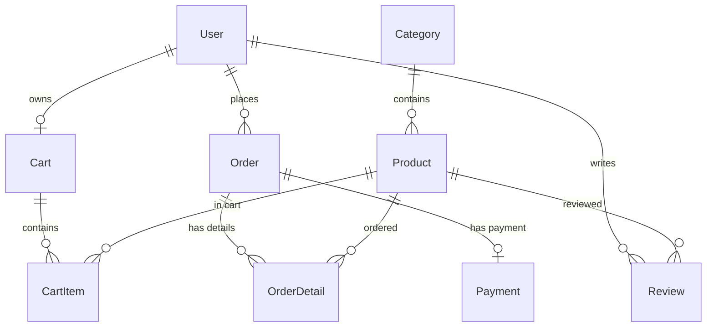

# Database Design & Schema Contract

This document outlines the database design, schema contract, and Phase 2 stability rules for the Electronics E-Commerce Project. All implementations in Phase 1 (and subsequent phases) must strictly respect and consume this schema.

---

## 1. Objective and Stability Contract

As defined in the project plan, **the database schema is finalized early** during Phase 1. 
- **Stability Rule:** Later development phases (including Phase 2) must **consume, not redefine**, the model names, field names, enum values, and relationships established here.
- **Change Management:** Any changes to the database schema require:
  1. An explicit migration note documenting the business reason.
  2. Coordinated updates across all affected backend controllers, models, and frontend views.
  3. No introduction of Supabase Auth (authentication remains JWT-based).
  4. No direct frontend-to-database connections.

---

## 2. Models & Fields Summary

The schema consists of **9 primary entities** mapped through Prisma to the Supabase PostgreSQL database.

### 2.1. User
Represents customers and administrators.
- **Fields:**
  - `id` (String, UUID, Primary Key)
  - `username` (String)
  - `email` (String, Unique)
  - `passwordHash` (String, mapped to database as `password_hash`)
  - `fullName` (String, Optional, mapped to database as `full_name`)
  - `phone` (String, Optional)
  - `address` (String, Optional)
  - `role` (Role enum: `customer`, `admin`, default: `customer`)
  - `createdAt` (DateTime, default: `now()`, mapped as `created_at`)
  - `updatedAt` (DateTime, updated automatically, mapped as `updated_at`)
- **Relationships:**
  - `cart` (1-to-1 with `Cart`)
  - `orders` (1-to-many with `Order`)
  - `reviews` (1-to-many with `Review`)

### 2.2. Category
Groups products for catalog navigation.
- **Fields:**
  - `id` (String, UUID, Primary Key)
  - `name` (String, Unique)
  - `description` (String, Optional)
  - `createdAt` (DateTime, default: `now()`, mapped as `created_at`)
  - `updatedAt` (DateTime, updated automatically, mapped as `updated_at`)
- **Relationships:**
  - `products` (1-to-many with `Product`)

### 2.3. Product
Represents items available for purchase in the store.
- **Fields:**
  - `id` (String, UUID, Primary Key)
  - `name` (String)
  - `brand` (String)
  - `description` (String, Optional)
  - `price` (Decimal, precision `10, 2`)
  - `quantity` (Int, stock level)
  - `imageUrl` (String, Optional, mapped as `image_url`)
  - `categoryId` (String, UUID, Foreign Key, mapped as `category_id`)
  - `createdAt` (DateTime, default: `now()`, mapped as `created_at`)
  - `updatedAt` (DateTime, updated automatically, mapped as `updated_at`)
- **Relationships:**
  - `category` (Many-to-1 with `Category` via `categoryId`)
  - `cartItems` (1-to-many with `CartItem`)
  - `orderDetails` (1-to-many with `OrderDetail`)
  - `reviews` (1-to-many with `Review` with cascade delete on product deletion)

### 2.4. Cart
A shopping cart associated with a specific user.
- **Fields:**
  - `id` (String, UUID, Primary Key)
  - `userId` (String, UUID, Unique, Foreign Key, mapped as `user_id`)
  - `createdAt` (DateTime, default: `now()`, mapped as `created_at`)
  - `updatedAt` (DateTime, updated automatically, mapped as `updated_at`)
- **Relationships:**
  - `user` (1-to-1 with `User` via `userId`)
  - `items` (1-to-many with `CartItem` with cascade delete on cart deletion)

### 2.5. CartItem
An item placed within a user's shopping cart.
- **Fields:**
  - `id` (String, UUID, Primary Key)
  - `cartId` (String, UUID, Foreign Key, mapped as `cart_id`)
  - `productId` (String, UUID, Foreign Key, mapped as `product_id`)
  - `quantity` (Int)
  - `unitPrice` (Decimal, precision `10, 2`, mapped as `unit_price`)
  - `createdAt` (DateTime, default: `now()`, mapped as `created_at`)
  - `updatedAt` (DateTime, updated automatically, mapped as `updated_at`)
- **Constraints & Indexes:**
  - `@@unique([cartId, productId])` (Prevents duplicate entries of the same product in a single cart)
- **Relationships:**
  - `cart` (Many-to-1 with `Cart` via `cartId`, cascade delete on cart deletion)
  - `product` (Many-to-1 with `Product` via `productId`)

### 2.6. Order
An order placed by a user.
- **Fields:**
  - `id` (String, UUID, Primary Key)
  - `userId` (String, UUID, Foreign Key, mapped as `user_id`)
  - `totalAmount` (Decimal, precision `10, 2`, mapped as `total_amount`)
  - `status` (OrderStatus enum, default: `pending`)
  - `shippingAddress` (String, mapped as `shipping_address`)
  - `createdAt` (DateTime, default: `now()`, mapped as `created_at`)
  - `updatedAt` (DateTime, updated automatically, mapped as `updated_at`)
- **Relationships:**
  - `user` (Many-to-1 with `User` via `userId`)
  - `details` (1-to-many with `OrderDetail` with cascade delete on order deletion)
  - `payment` (1-to-1 with `Payment` with cascade delete on order deletion)

### 2.7. OrderDetail
Line items within an order.
- **Fields:**
  - `id` (String, UUID, Primary Key)
  - `orderId` (String, UUID, Foreign Key, mapped as `order_id`)
  - `productId` (String, UUID, Foreign Key, mapped as `product_id`)
  - `quantity` (Int)
  - `price` (Decimal, precision `10, 2`)
- **Relationships:**
  - `order` (Many-to-1 with `Order` via `orderId`, cascade delete on order deletion)
  - `product` (Many-to-1 with `Product` via `productId`)

### 2.8. Payment
The payment record linked to an order.
- **Fields:**
  - `id` (String, UUID, Primary Key)
  - `orderId` (String, UUID, Unique, Foreign Key, mapped as `order_id`)
  - `paymentMethod` (PaymentMethod enum, default: `COD`, mapped as `payment_method`)
  - `paymentStatus` (PaymentStatus enum, default: `unpaid`, mapped as `payment_status`)
  - `amount` (Decimal, precision `10, 2`)
  - `paymentDate` (DateTime, Optional, mapped as `payment_date`)
- **Relationships:**
  - `order` (1-to-1 with `Order` via `orderId`, cascade delete on order deletion)

### 2.9. Review
A user review and rating for a specific product.
- **Fields:**
  - `id` (String, UUID, Primary Key)
  - `userId` (String, UUID, Foreign Key, mapped as `user_id`)
  - `productId` (String, UUID, Foreign Key, mapped as `product_id`)
  - `rating` (Int, 1 to 5)
  - `comment` (String, Optional)
  - `status` (ReviewStatus enum, default: `visible`)
  - `createdAt` (DateTime, default: `now()`, mapped as `created_at`)
  - `updatedAt` (DateTime, updated automatically, mapped as `updated_at`)
- **Relationships:**
  - `user` (Many-to-1 with `User` via `userId`)
  - `product` (Many-to-1 with `Product` via `productId`, cascade delete on product deletion)

---

## 3. Database Enums

To ensure data integrity, the schema leverages five strict enums.

| Enum Name | Allowed Values | Description |
|---|---|---|
| `Role` | `customer`, `admin` | User authorization privileges. |
| `OrderStatus` | `pending`, `confirmed`, `shipping`, `completed`, `cancelled` | Lifespan stages of a customer order. |
| `PaymentMethod` | `COD` | Supported payment options (Phase 1/2 restricted to COD). |
| `PaymentStatus` | `unpaid`, `paid`, `failed` | Transaction payment states. |
| `ReviewStatus` | `visible`, `hidden` | Review moderation status. |

---

## 4. Relationship Summary Diagram



---

## 5. CLI Commands Reference

All database synchronization and initial data loading should be managed through the Prisma CLI in the `backend/` directory.

### 5.1. Database Migration
To apply schema changes and synchronize the database state (requires valid `DATABASE_URL` and `DIRECT_URL` in `backend/.env`):
```bash
cd backend
npx prisma migrate dev --name init
```

### 5.2. Seeding default data
To populate the database with default Categories, Products, a test Customer, and a test Admin (with bcrypt-hashed passwords):
```bash
cd backend
npx prisma db seed
```

### 5.3. Schema Validation
To statically check `schema.prisma` for semantic correctness:
```bash
cd backend
npx prisma validate
```

### 5.4. Database Verification
To verify data and view generated tables, consult the **Supabase Table Editor** on the Supabase dashboard project dashboard, or spin up the Prisma studio locally:
```bash
cd backend
npx prisma studio
```
